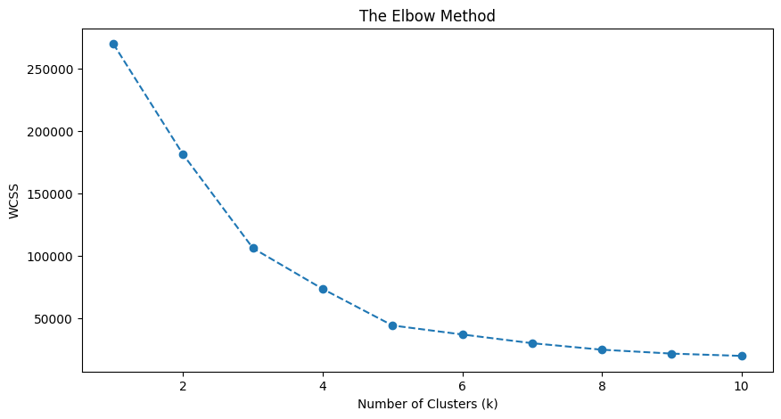
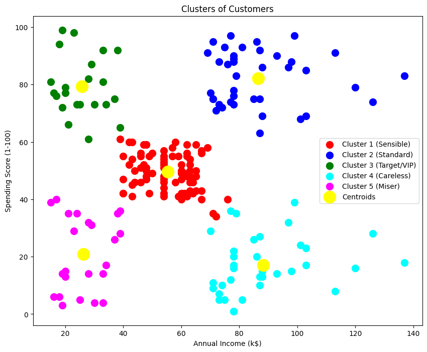

# Customer Segmentation using K-Means Clustering (Task 2)

## Project Overview
The goal of this project is to group customers of a retail mall based on their spending habits and annual income. This helps in understanding different customer segments and creating targeted marketing strategies.

## Dataset
The dataset contains information about mall customers:
* **Gender & Age**: Demographic information.
* **Annual Income (k$)**: How much the customer earns yearly.
* **Spending Score (1-100)**: A score assigned based on customer behavior and spending nature.

## Methodology
1. **Exploratory Data Analysis (EDA)**: Analyzed the distribution of income and spending.
2. **The Elbow Method**: Used to find the optimal number of clusters (K). For this dataset, **K = 5** was chosen.
3. **K-Means Clustering**: Applied the algorithm to group customers into 5 distinct segments.
4. **Visualization**: Created a scatter plot to visualize the clusters and their centroids.

## Key Findings (Customer Segments)
* **Cluster 4 (Target/VIP)**: High income and high spending. These are the most valuable customers.
* **Cluster 2 (Careful)**: High income but low spending. They need promotions to encourage them.
* **Cluster 1 (Standard)**: Average income and average spending.
* **Cluster 5 (Impulsive)**: Low income but high spending.
* **Cluster 3 (Sensible)**: Low income and low spending.

## Visualizations
### The Elbow Method

### Final Customer Clusters

## Libraries Used
* Pandas & NumPy
* Matplotlib & Seaborn
* Scikit-Learn