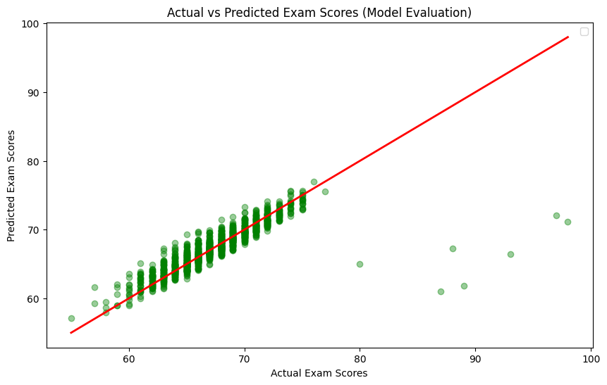

# Student Performance Prediction (Task 1)

## Project Overview
This project aims to predict students' final exam scores based on various factors such as study hours, attendance, and parental involvement using **Linear Regression**.

## Dataset
The dataset contains information about student demographics, study habits, and school-related factors.
* **Key Features:** Hours Studied, Attendance, Previous Scores.
* **Target:** Exam Score.

## Project Steps
1. **Data Cleaning:** Handled missing values in categorical columns using the mode.
2. **EDA (Exploratory Data Analysis):** Visualized relationships using Heatmaps and Scatter plots.

3. **Pre-processing:** Applied Label Encoding to convert categorical data into numerical format.
4. **Modeling:** Trained a Multiple Linear Regression model.
5. **Evaluation:** Evaluated the model using R-squared and MSE metrics.

## Libraries Used
* Pandas & NumPy
* Matplotlib & Seaborn
* Scikit-Learn